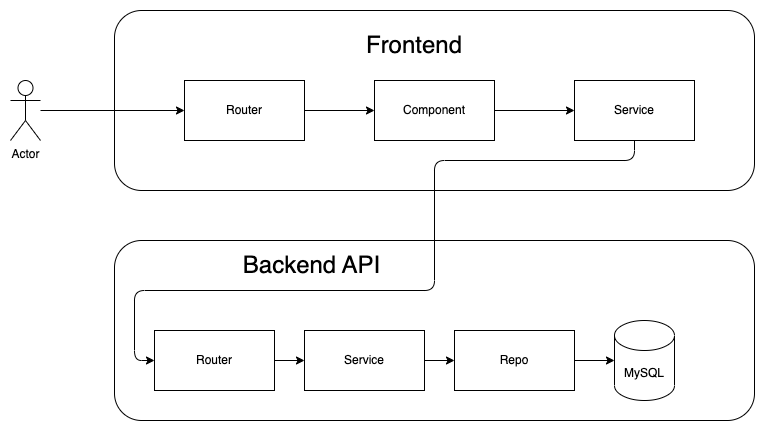

Movierama
==

# Overview

<b>Movierama</b> is a social network about movies.

# Quick Start

Just execute `make serve` to serve the program via docker.

# Features

- Users should be able to log into their account or sign up for a new one
- Users should be able to add movies by completing a form. Movies should be persisted and reference the user that
  submitted them.
- Users should be able to express their opinion for any movie by either a like or a hate.
- Users can vote only once for each movie and can change their vote at any time by switching to the opposite vote or by
  retracting their vote altogether.
- Users should not be able to vote for the movies they have submitted.
- Users should be able to view the list of movies and sort them by number of likes, number of hates or date added.
- Users should be able to view all movies submitted by a specific user.

## Tech Stack

| Type               | Item    | Version |
|--------------------|---------|---------|
| FrontEnd Framework | Angular | v15     |
| BackEnd Language   | Go      | v1.18   |
| BackEnd Framework  | Echo    | v4      |

## Infrastructure Services

| Type  | Provider | Version | Purpose            |
|-------|----------|---------|--------------------|
| RDBMS | MySQL    | v8      | Persistent Storage |

# API

## HTTP

Postman Collection Location: _under doc/postman/_

# Developers Handbook

## Build and Run

Please use `make <target>` where `<target>` is one of the following:

``` makefile
`serve`                          Serve the app with Docker Compose
`stop`                           Stop the Docker Compose app
```

There is a second makefile at `movierama-backend` directory which provides some extra functionalities such as linting,
testing,
ci, etc..:

``` makefile
`ci`                             Run the CI pipeline
`lint`                           Perform linting
`serve`                          Serve the app with Docker Compose
`stop`                           Stop the Docker Compose app
`test`                           Run unit tests
```

# Technical Details

## Technical Overview



## What has been implemented

- [x] Table-driven tests
- [x] Unit testing.
- [ ] Integration testing.
- [ ] E2E testing.
- [ ] Benchmark testing.
- [x] Use of service-repo pattern.
- [ ] Caching layer using decorator pattern.
- [ ] Adapter pattern for handling the dynamic data types.
- [ ] Use of builder pattern for creating objects.
- [x] Postman collection.
- [x] Docker implementation.

## Future Improvements

- On movie creation the newly created movie should be returned from the writer in order to avoid mysql master-slave
  issues.
- JWT token should contain an encrypted payload, now it can be decoded and reveal the real user id. Should avoid using
  the JWT user id, as is, in the backend side.
- In the current implementation Users, Movies & Actions are coupled into the same db. This can cause scalability issues.
  In order to decouple these, new services should be created that aggregates Movies & Actions along with users using the
  BFF pattern.
- A caching mechanism should be implemented for improving performance. A suggested way is to use the decorator pattern
  in order to encapsulate the repo and cache the repo results.
- Better configuration management system with multiple type conversions.
- Add validators for validating user input.
- Avoid exposing real ids.
- Improve testing code coverage (especially in main.go)
- Add pagination.
